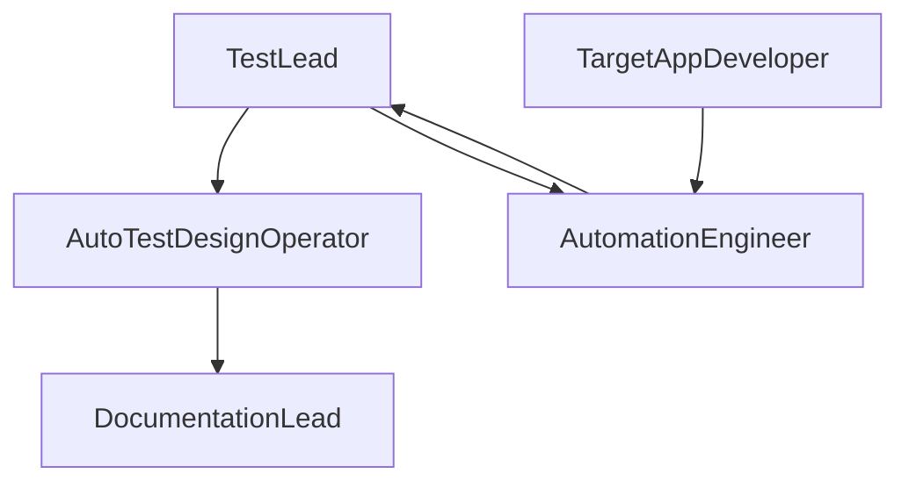

# Test Plan — Login Web Module

**Team ID:** [填写]  
**Members:** [姓名 / 学号]

---

## 1. Project scope

**Background:** University Assignment 2 — validate a login module using an AI-assisted test design tool.  
**Objective:** Demonstrate risk-based test planning, ISO 29119-4 techniques, partial automation, and traceability from requirements to results.

**In scope:** Login form validation, authentication, error messages, account lockout.  
**Out of scope:** Registration, password reset, OAuth, performance load testing.

## 2. Test items

| Item | Type | Description |
|------|------|-------------|
| Username field | Functional | Length 3–20 |
| Password field | Functional | Length 8–32, ≥1 digit |
| Login action | Functional | Valid/invalid credentials |
| Lockout | Functional | 3 failures → 30s lock |
| Error display | UI | `#error-msg` visibility |

**Architecture:** Flask monolith, server-side validation, session cookie, in-memory lock state.

## 3. Advanced test suite design

| Suite | Techniques | Rationale |
|-------|------------|-----------|
| TS-01 Input validation | EP, BVA | Data ranges in REQ-001/002 |
| TS-02 Login decisions | Decision table | Combinations REQ-003–006 |
| TS-03 Security control | State transition | REQ-007 lock flow |
| TS-04 Regression smoke | Automated subset | CI-ready critical path |

## 4. Schedule / checklist

| Level | Target | Status |
|-------|--------|--------|
| Component | Validation functions | Planned |
| Integration | Form POST → redirect | Planned |
| System | E2E Playwright | In progress |
| Acceptance | Demo scenarios | Week 4 |

## 5. Organization

| Role | Responsibility |
|------|----------------|
| Test Lead | Plan approval, risk sign-off |
| AutoTestDesign Operator | Import reqs, review cases, export CSV |
| Target App Developer | Maintain `target-app/` |
| Automation Engineer | Playwright scripts, results |
| Documentation Lead | PDF reports, demo PPT |

## 6. Test framework selection

**Selected:** PyTest + Playwright  

**Rationale:** Native Python alignment with AutoTestDesign; reliable browser automation; good reporting for academic demo.

**Alternatives considered:** Selenium (heavier setup), JUnit (Java stack mismatch).

## 7. Cost estimate (using AutoTestDesign on target app)

| Activity | Manual (hours) | With tool (hours) |
|----------|----------------|-------------------|
| Requirement structuring | 4 | 0.5 |
| Risk assessment | 3 | 0.5 |
| Test case design (3 techniques) | 16 | 2 |
| Review & refinement | 4 | 4 |
| Automation (10 scripts) | 12 | 10 |
| **Total** | **39** | **17** |

**Savings:** ~56% design effort; review time unchanged (human-in-the-loop per assignment requirements).

---

*Export test cases from Streamlit → `target-app-tests/` mapping.*
