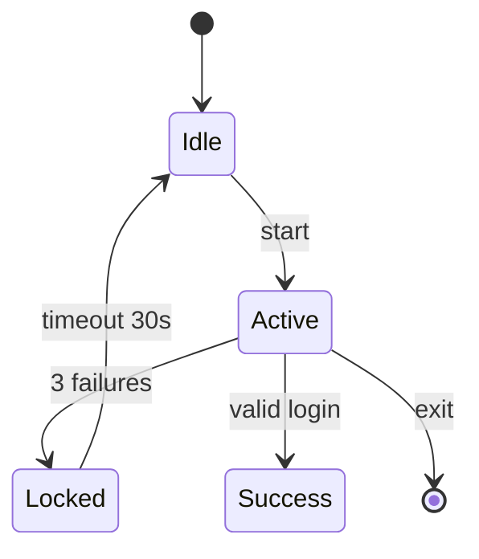

# AutoTestDesign 用户使用手册

> 环境安装与命令速查见项目根目录 **[README.md](../README.md)**。  
> 多套现成需求见 **[project-templates.md](project-templates.md)**。

---

## 目录

1. [项目简介](#1-项目简介)
2. [文档分工](#2-文档分工)
3. [两个 Web 分别是什么](#3-两个-web-分别是什么)
4. [快速上手（5 步）](#4-快速上手5-步)
5. [如何填写需求（Import）](#5-如何填写需求import)
6. [Import 三个按钮](#6-import-三个按钮)
7. [Streamlit 各标签页](#7-streamlit-各标签页)
8. [侧边栏与 LLM](#8-侧边栏与-llm)
9. [White-Box 白盒测试](#9-white-box-白盒测试)
10. [执行测试用例 — Test Runner](#10-执行测试用例--test-runner)
11. [REST API 接口](#11-rest-api-接口)
12. [被测登录应用](#12-被测登录应用)
13. [演示与作业流程](#13-演示与作业流程)
14. [完整端到端工作流](#14-完整端到端工作流)
15. [常见问题](#15-常见问题)
16. [文件索引](#16-文件索引)

---

## 1. 项目简介

AutoTestDesign 是一个 **AI 驱动的测试用例设计工具**。输入自然语言需求，自动产出结构化测试用例，覆盖等价类划分、边界值分析、判定表、状态转换、语句/分支/路径/MC/DC 等黑盒与白盒技术。

**核心能力：**

| 能力 | 说明 |
|------|------|
| 需求导入 | 支持 CSV / 纯文本 / 粘贴，自动结构化字段提取 |
| 风险分析 | 可配置权重的 H/M/L 风险评分 |
| 黑盒技术 | 等价类划分 (EP)、边界值分析 (BVA)、判定表 (Decision Table) |
| 白盒技术 | 状态机 / 控制流图，7 种覆盖准则（state, transition, statement, branch, path, condition, MC/DC） |
| 交互式评审 | 在线编辑覆盖项、策略、测试用例，修改记录可追溯 |
| 双向可追溯 | 需求 ↔ 覆盖项 ↔ 测试用例 下钻统计 |
| 证据驱动改进 | 标记无效用例 → LLM 反馈闭环 → 补充用例 |
| 用例集优化 | 去重 + 风险排序 |
| 测试预言 | 规则驱动的登录模块预言生成 |
| 多格式导出 | JSON / CSV，可选白盒结果和优化后套件 |
| 自动化执行 | Test Runner 读取导出的用例 JSON，自动执行并生成通过/失败报告 |

**双模式运行：**

| 模式 | 条件 | 特点 |
|------|------|------|
| **LLM 模式**（绿标） | `.env` 中配置了 `OPENAI_API_KEY` | 调用大模型，自然语言理解更强 |
| **规则降级**（黄标） | 未配置 Key | 使用内置规则引擎，离线、快速、可复现 |

不配置 LLM 也能完成全部功能需求。

---

## 2. 文档分工

| 你想… | 看哪里 |
|--------|--------|
| 装环境、跑命令 | [README.md](../README.md) |
| 学界面、写需求、做演示、跑白盒、执行用例 | 本手册 |
| 复制整套项目名 + 需求 CSV | [project-templates.md](project-templates.md) |
| 写风险报告 / 测试计划 PDF | `docs/risk-analysis.md` 等草稿 |

---

## 3. 两个 Web 分别是什么

| 应用 | 地址 | 作用 |
|------|------|------|
| **AutoTestDesign 工具** | http://localhost:8501 | 测试**设计**：导入需求、生成用例、审查、导出 |
| **登录模块（被测系统）** | http://127.0.0.1:5000 | **被测对象**：手工或 pytest 执行，写进作业报告 |

```powershell
conda activate autotestdesign

# 终端 1 — 工具
streamlit run autotestdesign/ui/streamlit_app.py

# 终端 2 — 被测应用（验证/演示时）
python target-app/app.py
```

---

## 4. 快速上手（5 步）

1. 按 [README](../README.md) 创建 conda 环境并 `conda activate autotestdesign`。
2. 启动 Streamlit；侧边栏 **New project** → 名称填 `Login Module Test`。
3. **Import** 页：选 **Sample login requirements** 或从 [模板 1](project-templates.md#template-1--login-module-english--recommended) 粘贴 CSV → **Run full pipeline**（模板全文见 project-templates.md）。
4. 依次查看 **Risk**、**Test Cases**、**Traceability**；在 **Test Cases** 改一条用例并 **Save**。
5. **Export** 下载 CSV；另开终端跑 `pytest target-app-tests/test_login_client.py -v`（可不启 Streamlit）。

处理耗时操作时，界面会显示英文状态面板、进度条和 Toast，完成后顶部有 **Last operation** 提示。

---

## 5. 如何填写需求（Import）

侧边栏先 **Create project**。Import 大文本框支持三种格式（**Format hint** 见下表）。

| Format hint | 适用 |
|-------------|------|
| **auto** | 默认；能识别 CSV 或按行解析 |
| **csv** | 第一行为表头 `id,text` |
| **text** | 每行一条需求，可无表头 |

### 5.1 标准 CSV（推荐）

第一行必须是 `id,text`（也可加可选列 `title`）：

```csv
id,text
REQ-001,The system shall accept username between 3 and 20 characters
REQ-002,The system shall accept password between 8 and 32 characters with at least one digit
REQ-003,Empty username shall show error message username is required
```

完整 7 条登录需求见 `sample_data/login_requirements.csv` 或 [project-templates 模板 1/2](project-templates.md)。

### 5.2 无表头（与界面 Sample 相同）

```text
REQ-001,The system shall accept username between 3 and 20 characters
REQ-002,The system shall accept password between 8 and 32 characters with at least one digit
```

**Format hint** 用 **auto**。

### 5.3 纯文本（一行一条）

```text
REQ-001: 用户名长度必须在 3 到 20 个字符之间
REQ-002: 密码长度必须在 8 到 32 个字符之间，且至少包含一个数字
```

编号支持：`REQ-001`、`REQ_001`、`1.` 等；也可不写编号（系统自动生成 ID）。

### 5.4 需求撰写建议

| 写清楚 | 示例 |
|--------|------|
| 字段名 | username、password |
| 范围 | 3–20 字符、8–32 字符 |
| 规则 | 至少 1 个数字、失败 3 次锁定 |
| 预期 | 错误文案、跳转 success |
| 有效数据 | user01 / Pass1234（须与 `target-app` 一致） |

---

## 6. Import 三个按钮

| 按钮 | 作用 |
|------|------|
| **Import only** | 仅导入需求列表（FR 1.0） |
| **Import + Structure** | 导入 + 结构化字段（FR 1.1） |
| **Run full pipeline** | 导入 → 结构化 → 风险 → EP/BVA/判定表（**首次建议**） |

**Source：**

- **Paste** — 使用文本框内容  
- **Sample login requirements** — 内置 7 条英文登录需求  

---

## 7. Streamlit 各标签页

| 标签 | 功能 | 作业对应 |
|------|------|----------|
| **Import** | 导入、结构化、一键流水线 | FR 1.0 / 1.1 |
| **Risk** | 风险分、H/M/L、理由；可调权重 | FR 2.0、风险报告 |
| **Coverage** | 覆盖项编辑；可触发生成用例 | 交互审查、覆盖项 |
| **Strategy** | 测试技术与理由 | 覆盖策略 |
| **Test Cases** | 用例编辑、按需求重生成、预言生成 | FR 3.0 / 5.0、交互审查 |
| **White-Box** | 状态机/控制流图建模、7种覆盖准则 | FR 4.0 |
| **Traceability** | 需求–覆盖–用例统计与下钻 | 可追溯矩阵 |
| **Improvement** | 审查日志、标记无效用例、补充用例 | 证据驱动改进 |
| **Export** | JSON/CSV；可选白盒、套件优化 | FR 6.0 / 4.0 / 7.0 |

### 7.1 各标签页详解

**Import** — 需求导入入口。粘贴需求文本，选择 Format hint 和 Source，点击对应按钮。Run full pipeline 会依次执行结构化、风险分析、三种黑盒技术生成用例。

**Risk** — 查看每条需求的风险评分（H/M/L）及理由。侧边栏可调整 Business Impact / Failure Probability / Detectability 三项权重。可手动修改评分后保存。

**Coverage** — 查看所有覆盖项（等价类、边界值、判定表规则等），可编辑覆盖项的内容、关联需求、优先级。支持按需求过滤。

**Strategy** — 查看每条需求采用的测试技术与选择理由。可手动调整策略。

**Test Cases** — 核心页面。显示所有生成的测试用例（用例ID、标题、步骤、预期结果、关联需求、优先级）。支持：
- 在线编辑用例内容并 **Save**
- 按需求 ID 过滤
- 针对单条需求 **Regenerate** 用例
- 生成测试预言（Oracle）

**White-Box** — 详见 [第 9 节](#9-white-box-白盒测试)。

**Traceability** — 双向可追溯矩阵：
- 需求 → 覆盖项 → 测试用例 的层级统计
- 点击需求可下钻查看关联的覆盖项和用例
- 导出前检查覆盖率

**Improvement** — 证据驱动的用例改进：
- 查看审查日志（Review Events）
- 标记用例为 Invalid，填写原因
- 点击 **Improve with LLM Feedback** 触发 LLM 分析无效用例并生成改进建议

**Export** — 导出测试产物：
- 格式：JSON / CSV
- 可选包含白盒覆盖序列
- 可选应用套件优化（去重 + 风险排序）

---

## 8. 侧边栏与 LLM

| 显示 | 含义 |
|------|------|
| **LLM enabled**（绿） | `.env` 中已配置 `OPENAI_API_KEY`，调用大模型 + `prompts/` |
| **Rule-based fallback**（黄） | 未配置 Key，使用内置规则引擎（离线、可复现） |

**LLM 不是默认开启的。** 不配置 Key 也能完成演示与 FR；配置后结构化与自然语言理解通常更好。

`.env` 示例（复制 `.env.example`）：

```env
OPENAI_API_KEY=sk-...
OPENAI_BASE_URL=https://api.deepseek.com/v1
OPENAI_MODEL=deepseek-chat
TARGET_APP_URL=http://127.0.0.1:5000
```

**Open project / Load project** — 打开 `data/projects/` 下已保存项目。  
**New project** — 填写项目名称与被测系统描述（可与 [模板](project-templates.md) 一致）。  
**Risk Weights** — 调整风险评分三项权重，影响 Risk 页的 H/M/L 判定。

---

## 9. White-Box 白盒测试

White-Box 标签页支持定义状态机或控制流图模型，并基于覆盖准则生成测试序列。

### 9.1 模型类型

| 模型 | 适用场景 | 可用覆盖准则 |
|------|----------|-------------|
| **State Machine**（状态机） | 登录流程、订单状态、工作流 | state, transition |
| **Control Flow Graph**（控制流图） | 函数/方法内部逻辑 | statement, branch, path, condition, MC/DC |

### 9.2 输入方式

**方式一：手动输入（Mermaid / JSON）**

直接在文本框粘贴 Mermaid 状态图或 JSON 模型定义。工具自动检测格式并解析。

Mermaid 状态图示例：



**方式二：LLM 从需求推导**

点击 **Derive from Requirements**，LLM 会根据已导入的需求自动生成状态机或控制流图模型。需要配置 LLM。

### 9.3 覆盖准则

生成覆盖序列前，勾选需要的覆盖准则：

- **State Machine:** `state`（状态覆盖）、`transition`（转换覆盖）
- **Control Flow Graph:** `statement`（语句覆盖）、`branch`（分支覆盖）、`path`（路径覆盖）、`condition`（条件覆盖）、`MC/DC`（修正条件/判定覆盖）

### 9.4 优化

勾选 **Apply optimization** 启用路径优化：
- 中国邮递员问题算法（最小化遍历所有转换的路径）
- 贪心集合覆盖（最小化序列数量）
- 路径合并
- 风险加权排序

### 9.5 生成与导出

点击 **Generate Coverage Sequences** 生成覆盖序列。结果可在 White-Box 页查看，导出时勾选 "Include white-box results" 即可将白盒序列包含在导出 JSON 中。

---

## 10. 执行测试用例 — Test Runner

Test Runner 是一个 CLI 工具，读取导出的项目 JSON 文件，自动执行所有测试用例并生成通过/失败报告。

### 10.1 基本用法

```powershell
conda activate autotestdesign

# 使用 Flask test client 模式（不需要启动 SUT）
python -m test_runner exports/project.json -m test_runner/mappings/login.json

# 使用 HTTP 模式（需要先启动 SUT）
python -m test_runner exports/project.json -m test_runner/mappings/login.json --mode http --base-url http://127.0.0.1:5000

# 保存 JSON 报告
python -m test_runner exports/project.json -m test_runner/mappings/login.json -o report.json
```

### 10.2 参数说明

| 参数 | 说明 |
|------|------|
| `project` | 导出的项目 JSON 文件路径 |
| `-m / --mapping` | SUT 映射配置文件路径 |
| `--mode` | `client`（Flask test client，默认）或 `http`（需要 SUT 运行中） |
| `--base-url` | HTTP 模式下 SUT 地址，会覆盖 mapping 中的配置 |
| `-o / --output` | 保存 JSON 格式报告到指定文件 |

### 10.3 映射配置（Mapping Config）

映射配置文件定义了 SUT 的接口和断言规则。以 `test_runner/mappings/login.json` 为例：

```json
{
  "sut": {
    "name": "Login Module",
    "module": "target-app.app",
    "app_var": "app"
  },
  "base_url": "http://127.0.0.1:5000",
  "reset_endpoint": "/reset",
  "endpoints": {
    "login": {
      "method": "POST",
      "path": "/",
      "params": ["username", "password"]
    }
  },
  "default_endpoint": "login",
  "params_defaults": {
    "username": "user01",
    "password": "Pass1234"
  },
  "assertion_rules": [
    {
      "match": "redirect|302|welcome|/success|success page",
      "use": "redirect_or_text"
    },
    {
      "match": "locked|lock|Account locked",
      "use": "text_contains_fuzzy",
      "repeat": 3
    }
  ],
  "default_assertion": "text_contains_fuzzy"
}
```

关键字段：
- `sut.module` / `sut.app_var`：client 模式下 Flask app 的导入路径
- `endpoints`：定义接口的 HTTP 方法、路径和参数名
- `params_defaults`：当用例缺少某参数时的默认值
- `assertion_rules`：断言策略列表，按顺序匹配，命中后使用对应策略
  - `text_contains_fuzzy`：模糊文本匹配（忽略大小写和标点）
  - `redirect_or_text`：检测重定向或文本
  - `repeat`：对锁定等场景，重复执行 N 次
- `default_assertion`：未命中任何规则时的兜底断言策略

### 10.4 导出与执行的完整流程

```
Streamlit Export → exports/project.json → Test Runner → 通过/失败报告
```

用例中的 `expected_result` 字段会与 SUT 的实际响应进行断言匹配。断言失败会显示期望值与实际值的对比。

---

## 11. REST API 接口

除了 Streamlit UI，还提供 FastAPI REST 接口用于程序化调用：

### 11.1 启动 API 服务

```powershell
uvicorn autotestdesign.app.main:app --reload --port 8000
```

启动后访问 http://localhost:8000/docs 查看 Swagger 文档。

### 11.2 接口列表

| 方法 | 路径 | 说明 |
|------|------|------|
| `POST` | `/projects` | 创建项目（传入需求文本） |
| `GET` | `/projects/{id}` | 获取项目详情 |
| `GET` | `/projects/{id}/export/json` | 导出 JSON |
| `GET` | `/projects/{id}/export/csv` | 导出 CSV |

### 11.3 调用示例

```powershell
# 创建项目
curl -X POST http://localhost:8000/projects \
  -H "Content-Type: application/json" \
  -d '{"name": "Login Test", "requirements_text": "REQ-001,username 3-20 chars\nREQ-002,password 8-32 chars"}'

# 导出 JSON
curl http://localhost:8000/projects/{project_id}/export/json -o test_cases.json
```

---

## 12. 被测登录应用

访问 http://127.0.0.1:5000（须先 `python target-app/app.py`）。

| 输入 | 结果 |
|------|------|
| 空用户名 | username is required |
| 空密码 | password is required |
| 用户名 &lt;3 或 &gt;20 | invalid username |
| 密码不合规 | invalid password |
| user01 + Pass1234 | 成功页 `/success` |
| usr + Pass1234 | 成功（边界账号） |
| 其他组合 | invalid credentials |
| 连续 3 次错误密码 | 锁定约 30 秒 |

自动化重置：http://127.0.0.1:5000/reset  

工具**只设计用例**；执行见 README 中的 `pytest` 命令或本手册第 10 节的 Test Runner。

---

## 13. 演示与作业流程

**15 分钟演示建议顺序：**

1. 说明工具 vs 被测系统（§3）  
2. Import → Run full pipeline → 展示结构化表  
3. Risk → Test Cases → Traceability  
4. White-Box：手动输入/LLM推导 → 生成覆盖序列  
5. 现场修改一条用例 → Improvement 审查记录 → Export JSON  
6. Test Runner 执行导出的用例，展示通过/失败报告  
7. 启动 `target-app`，演示 1～2 条；或运行 pytest 展示结果  

**与 PDF 交付物：**

| PDF | 数据来源 |
|-----|----------|
| 风险报告 | Export 前 Risk 表 + `docs/risk-analysis.md` |
| 测试计划 | `docs/test-plan.md` + 模板说明 |
| 详细设计执行 | 工具导出用例 + Test Runner 报告 + 截图 |

---

## 14. 完整端到端工作流

以下是从零开始使用本工具完成一个完整测试项目的推荐流程：

### 阶段一：环境准备

```powershell
# 1. 安装环境
conda env create -f environment.yml
conda activate autotestdesign

# 2. 配置 LLM（可选）
copy .env.example .env
# 编辑 .env 填入 API Key

# 3. 启动工具
streamlit run autotestdesign/ui/streamlit_app.py
```

### 阶段二：需求导入与用例生成

1. 浏览器打开 http://localhost:8501
2. 侧边栏 **New project** → 填写项目名称和被测系统描述
3. 在 **Import** 页粘贴需求（或使用 Sample / 模板）
4. 点击 **Run full pipeline** 一键生成
5. 依次检查 **Risk** → **Coverage** → **Strategy** → **Test Cases**
6. 在 **Test Cases** 中编辑、增删用例，点 **Save** 保存

### 阶段三：白盒测试（可选）

1. 切到 **White-Box** 标签页
2. 选择模型类型和输入方式
3. 手动粘贴 Mermaid 或点击 LLM 推导
4. 勾选覆盖准则 → **Generate Coverage Sequences**
5. 检查生成的覆盖序列

### 阶段四：审查与改进

1. 切到 **Traceability** 检查需求覆盖率
2. 如有遗漏，回到 Import 补充需求或手动添加用例
3. 切到 **Improvement**，标记不满意的用例为 Invalid
4. 点击 **Improve with LLM Feedback** 生成改进建议

### 阶段五：导出

1. 切到 **Export** 标签页
2. 选择格式（JSON / CSV）
3. 勾选 "Include white-box results"（如有白盒）
4. 勾选 "Optimize suite"（去重 + 风险排序）
5. 点击 **Export** 下载文件

### 阶段六：执行验证

```powershell
# 方式一：pytest 自动化测试
pytest target-app-tests/test_login_client.py -v

# 方式二：Test Runner 执行导出的用例
python -m test_runner exports/project.json -m test_runner/mappings/login.json -o report.json

# 方式三：手动验证
python target-app/app.py
# 浏览器打开 http://127.0.0.1:5000 手工测试
```

### 阶段七：生成报告

1. 填写 `docs/risk-analysis.md` 草稿（数据来自 Risk 表）
2. 填写 `docs/test-plan.md` 草稿
3. 填写 `docs/detailed-design-exec.md` 草稿（数据来自导出用例 + Test Runner 报告）
4. 各文档导出为 PDF 提交

---

## 15. 常见问题

**粘贴后 0 条需求？**  
检查是否为空；CSV 是否有 `text` 列；`Format hint` 是否匹配。

**中文需求可以吗？**  
可以。规则模式请写清字段与数字范围；LLM 模式理解更灵活。中文模板见 [project-templates 模板 2](project-templates.md#template-2--login-module-chinese)。

**用例很多是否正常？**  
每条需求 × 三种技术会产生较多用例；报告可只选高优先级子集，或用 Export 页 **Optimize suite**。

**pytest 是测工具还是测登录页？**  
测**登录被测应用**和工具 schema 单元测试；不是测 Streamlit 本身。

**Test Runner 的 client 和 http 模式怎么选？**
- `client` 模式：直接 import Flask app，不需要启动 SUT，速度快，适合 CI/批量执行
- `http` 模式：需要先启动 SUT，发送真实 HTTP 请求，适合端到端验证

**界面卡住？**  
长任务会显示 Running / 进度条；LLM 可能需 10–60 秒。侧边栏黄字表示规则模式通常更快。

**White-Box 模型解析失败？**  
检查 Mermaid 语法是否正确；JSON 模式确保字段名与 `StateMachine` / `ControlFlowGraph` 模型一致。可使用 LLM 推导作为替代。

**如何为其他 SUT 编写映射配置？**  
参考 `test_runner/mappings/login.json`，修改 `sut.module`、`endpoints`（接口路径和参数名）和 `assertion_rules`（断言匹配规则）。核心是让 Runner 知道如何调用你的 SUT 以及如何判断通过/失败。

---

## 16. 文件索引

| 路径 | 说明 |
|------|------|
| [README.md](../README.md) | 安装、命令表、FR 列表、提交清单 |
| [project-templates.md](project-templates.md) | 7 套项目模板（项目名 + 需求 CSV） |
| `sample_data/*.csv` | 可粘贴的需求文件 |
| `autotestdesign/prompts/` | LLM 提示词模板 |
| `autotestdesign/ui/streamlit_app.py` | Web UI 入口 |
| `autotestdesign/app/main.py` | REST API 入口 |
| `test_runner/__main__.py` | Test Runner CLI 入口 |
| `test_runner/mappings/login.json` | SUT 映射配置示例 |
| `export_templates/project_export_schema.json` | 导出 JSON Schema |
| `export_templates/test_cases_template.csv` | 导出 CSV 模板 |
| `docs/risk-analysis.md` | 风险报告草稿 |
| `docs/test-plan.md` | 测试计划草稿 |
| `docs/detailed-design-exec.md` | 详细设计执行草稿 |
| `docs/performance-nfr.md` | 性能 NFR 说明 |

---

*提交前请在 PDF 封面填写 Team ID、成员姓名与学号。*
